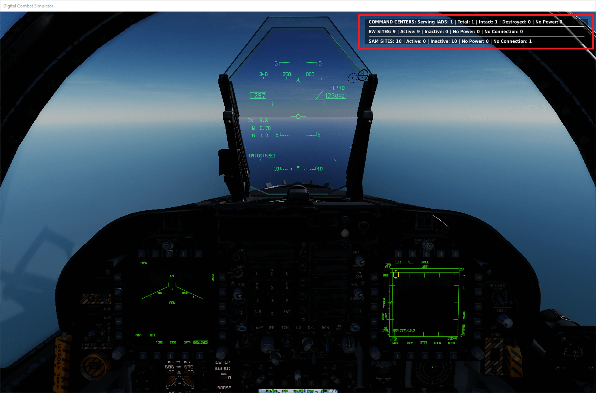

# API reference

This is the danger zone. Call Kenny Loggins. Some experience with scripting is recommended.
You can handcraft your IADS with the following functions. If you reference units that don't exist a
message will be displayed when the mission loads.
The following examples use static objects for command centers, connection nodes and power sources,
you can also use units instead.

## IADS configuration

Call this method to add or remove a radio menu to toggle the status output of the IADS. By default
the radio menu option is not visible:

```lua
redIADS:addRadioMenu()
```

```lua
redIADS:removeRadioMenu()
```

If you dereference the IADS remember to call `deactivate()` otherwise background tasks of the IADS
will continue running, resulting in unexpected behaviour:

```lua
redIADS:deactivate()
```

Set the update interval in seconds of the IADS. This determines in what interval the IADS will turn
SAM sites off or on according to targets it has detected:

```lua
redIADS:setUpdateInterval(5)
```

## Adding a command center

The command center represents the place where information is collected and analysed. If it is
destroyed the IADS disintegrates.

Add a command center like this:

```lua
local commandCenter = StaticObject.getByName("Command Center")
redIADS:addCommandCenter(commandCenter)
```

## Power sources and connection nodes

You can use units or static objects. Call the function multiple times to add more than one power
source or connection node.

`unit` refers to a SAM site or EW Radar you retrieved from the IADS — see [setting an
option](#setting-an-option):

```lua
local powerSource = StaticObject.getByName("EW Power Source")
unit:addPowerSource(powerSource)
```

```lua
local connectionNode = Unit.getByName("EW connection node")
unit:addConnectionNode(connectionNode)
```

For command centers use:

```lua
local commandCenter = StaticObject.getByName("Command Center2")
local comPowerSource = StaticObject.getByName("Command Center2 Power Source")
redIADS:addCommandCenter(commandCenter):addPowerSource(comPowerSource)
```

## Warm up the SAM sites of an IADS

This function is deprecated and will be removed in a future release.

```lua
redIADS:setupSAMSitesAndThenActivate()
```

## Connecting Skynet to the MOOSE AI_A2A_DISPATCHER

IRL an IADS would most likely not only handle SAM sites but also pass information to interceptor
aircraft. You can connect Skynet with MOOSE's
[AI_A2A_DISPATCHER](https://flightcontrol-master.github.io/MOOSE_DOCS/Documentation/AI.AI_A2A_Dispatcher.html)
to add interceptors to the IADS. This allows the IADS not only to direct SAM sites but also to
scramble fighters. Skynet will set the radars it can use on the SET_GROUP object of a dispatcher —
meaning that if a radar is lost in Skynet it will no longer be available to detect and scramble
interceptors. See the [moose_a2a_connector demo
mission](https://github.com/VEAF/Skynet-IADS/tree/master/demo-missions).

Add the object of type SET_GROUP to the IADS like this (in this example `DetectionSetGroup`):

```lua
redIADS:addMooseSetGroup(DetectionSetGroup)
```

A full example setup of Skynet and the AI_A2A_DISPATCHER:

```lua
-- Setup Skynet IADS:
redIADS = SkynetIADS:create('Enemy IADS')
redIADS:addSAMSitesByPrefix('SAM')
redIADS:addEarlyWarningRadarsByPrefix('EW')
redIADS:activate()

-- START MOOSE CODE:
-- Define a SET_GROUP object that builds a collection of groups that define the EWR network.
DetectionSetGroup = SET_GROUP:New()

-- Setup the detection and group targets to a 30km range!
Detection = DETECTION_AREAS:New( DetectionSetGroup, 30000 )

-- Setup the A2A dispatcher, and initialize it.
A2ADispatcher = AI_A2A_DISPATCHER:New( Detection )

-- Set 100km as the radius to engage any target by airborne friendlies.
A2ADispatcher:SetEngageRadius() -- 100000 is the default value.

-- Set 200km as the radius to ground control intercept.
A2ADispatcher:SetGciRadius() -- 200000 is the default value.

CCCPBorderZone = ZONE_POLYGON:New( "RED-BORDER", GROUP:FindByName( "RED-BORDER" ) )
A2ADispatcher:SetBorderZone( CCCPBorderZone )
A2ADispatcher:SetSquadron( "Kutaisi", AIRBASE.Caucasus.Kutaisi, { "Squadron red SU-27" }, 2 )
A2ADispatcher:SetSquadronGrouping( "Kutaisi", 2 )
A2ADispatcher:SetSquadronGci( "Kutaisi", 900, 1200 )
A2ADispatcher:SetTacticalDisplay(true)
A2ADispatcher:Start()
--END MOOSE CODE

-- add the MOOSE SET_GROUP to the IADS, from now on Skynet will update active radars that the
-- MOOSE SET_GROUP can use for EW detection.
redIADS:addMooseSetGroup(DetectionSetGroup)
```

## SAM site configuration

### Adding SAM sites

#### Add multiple SAM sites

Adds SAM sites with prefix in group name to the IADS. Previously added SAM sites are cleared:

```lua
redIADS:addSAMSitesByPrefix('SAM')
```

#### Add a SAM site manually

You can manually add a SAM site, must be a valid group name:

```lua
redIADS:addSAMSite('SA-6 Group2')
```

### Accessing SAM sites in the IADS

The following functions exist to access SAM sites added to the IADS. They all support daisy
chaining options:

Returns all SAM sites with the corresponding Nato name, see
[skynet-iads-supported-types.lua](https://github.com/VEAF/Skynet-IADS/blob/master/skynet-iads-source/skynet-iads-supported-types.lua).
For all units beginning with 'SA-': don't add Nato code names (Guideline, Gainful), just write
'SA-2', 'SA-6':

```lua
redIADS:getSAMSitesByNatoName('SA-6')
```

Returns all SAM sites in the IADS:

```lua
redIADS:getSAMSites()
```

Returns a SAM site with the specified group name:

```lua
redIADS:getSAMSiteByGroupName('SAM-SA-6')
```

Returns a SAM site with the specified group name prefix. Let's say you have a bunch of SAM sites
that all will share the same power source.
Give these sites a special prefix in the group name, e.g. `SAM-SECTOR-A`. Once you have added the
SAM sites you can access them via the prefix to set whatever options you want:

```lua
redIADS:getSAMSitesByPrefix('SAM-SECTOR-A')
```

### Act as EW radar

Will set the SAM site to act as an EW radar. This will result in the SAM site always having its
radar on. Contacts the SAM site sees are reported to the IADS. This option is recommended for long
range systems like the S-300:

```lua
samSite:setActAsEW(true)
```

### Engagement zone

Set the distance at which a SAM site will switch on its radar:

```lua
samSite:setEngagementZone(SkynetIADSAbstractRadarElement.GO_LIVE_WHEN_IN_SEARCH_RANGE)
```

#### Engagement zone options

SAM site will go live when target is within the red circle in the mission editor (default Skynet
behaviour):

```lua
SkynetIADSAbstractRadarElement.GO_LIVE_WHEN_IN_KILL_ZONE
```

SAM site will go live when target is within the yellow circle in the mission editor:

```lua
SkynetIADSAbstractRadarElement.GO_LIVE_WHEN_IN_SEARCH_RANGE
```

This option sets the range in relation to the zone you set in `setEngagementZone` for a SAM site to
go live. Be careful not to set the value too low. Some SAM sites need up to 30 seconds until they
can fire.
During this time a target might have already left the engagement zone of the SAM site. This option
is intended for long range systems like the S-300. You can also set the range above 100, which will
have the effect that the SAM site goes live earlier:

```lua
samSite:setGoLiveRangeInPercent(90)
```

### Engage air weapons

Will set the SAM site to engage air weapons, if it is able to do so in DCS. It is a wrapper for the
[ENGAGE_AIR_WEAPONS](https://wiki.hoggitworld.com/view/DCS_option_engage_air_weapons) setting.

```lua
samSite:setCanEngageAirWeapons(true)
```

### Engage HARM

Will set the SAM site to engage HARMs, if it is able to do so in DCS. If set to false the SAM site
will shut down if a HARM that has been identified by the IADS is inbound. SAM sites that can engage
HARMS are set to true by default.

```lua
samSite:setCanEngageHARM(true)
```

## Add go live constraints

You can include constraints which must be satisfied for the SAM site to go live. Please note this
only controls activation of the SAM site.
There is currently no way to tell a SAM site to only target a certain contact via the Lua scripting
engine in DCS.

The constraint must evaluate to true and the contact must be in range of the SAM site (handled by
Skynet).

### Use cases

Place a SAM site on a flight path that you suspect strike fighters will pass. Add a heading
constraint to ensure that the SAM site will only go live when fighters are on their way back from
the target.

Set a SAM site to only go live if aircraft are in a certain altitude band.

SAM site shall only go live once a strike package has destroyed a certain building or unit.

You do not have to use the contact provided in the function to evaluate the constraint. You can
make any assertion you want.

Create a function that will evaluate if the constraint is satisfied. The function will have access
to the [contact](#contact) the SAM site is evaluating:

```lua
--SAM site will only go live if the contact is below 1000 feet.
local function goLiveConstraint(contact)
	return ( contact:getHeightInFeetMSL() < 1000 )
end
```

Add the function to the SAM site and give it a name. You can add as many constraints as you wish:

```lua
self.samSite:addGoLiveConstraint('ignore-low-flying-contacts', goLiveConstraint)
```

Remove constraint you no longer wish to use:

```lua
self.samSite:removeGoLiveConstraint('ignore-low-flying-contacts')
```

Get a table of all constraints:

```lua
self.samSite:getGoLiveConstraints()
```

## Contact

You can use the following methods to get information about a contact.

Will return true if contact has been identified as a HARM by Skynet:

```lua
contact:isIdentifiedAsHARM()
```

Will return the height of a contact:

```lua
contact:getHeightInFeetMSL()
```

Will return the current magnetic heading of a contact. Note the heading is available only after a
contact has been tracked in more than one cycle by the IADS. Until that has happened heading will
be 0:

```lua
contact:getMagneticHeading()
```

Will return the current ground speed of a contact. Note the speed is available only after a contact
has been tracked in more than one cycle by the IADS. Until that has happened speed will be 0:

```lua
contact:getMagneticHeading()
```

Will return the time in seconds a contact has been known to the IADS:

```lua
contact:getAge()
```

Will return the type as an `Object.Category`:

```lua
contact:getTypeName()
```

Will return the unit name:

```lua
contact:getName()
```

## EW radar configuration

### Adding EW radars

#### Add multiple EW radars

Adds EW radars with prefix in unit name to the IADS. Previously added EW sites are cleared:

```lua
redIADS:addEarlyWarningRadarsByPrefix('EW')
```

#### Add an EW radar manually

You can add EW radars manually, must be a valid unit name:

```lua
redIADS:addEarlyWarningRadar('EWR West')
```

### Accessing EW radars in the IADS

The following functions exist to access EW radars added to the IADS. They all support daisy
chaining options.

Returns all EW radars in the IADS:

```lua
redIADS:getEarlyWarningRadars()
```

Returns the EW radar with the specified unit name:

```lua
redIADS:getEarlyWarningRadarByUnitName('EW-west')
```

## Options for SAM sites and EW radars

### Setting an option

In the following examples `ewRadarOrSamSite` refers to a single EW radar or SAM site or a table of
EW radars and SAM sites you got from the Skynet IADS, by calling one of the functions named in
[accessing EW radars](#accessing-ew-radars-in-the-iads) or [accessing SAM
sites](#accessing-sam-sites-in-the-iads).

### Daisy chaining options

You can daisy chain options on a single SAM site / EW Radar or a table of SAM sites / EW radars
like this:

```lua
redIADS:getSAMSites():setActAsEW(true):addPowerSource(powerSource):addConnectionNode(connectionNode):setEngagementZone(SkynetIADSAbstractRadarElement.GO_LIVE_WHEN_IN_SEARCH_RANGE):setGoLiveRangeInPercent(90):setAutonomousBehaviour(SkynetIADSAbstractRadarElement.AUTONOMOUS_STATE_DARK)
```

### HARM defence

You can set the reaction probability (between 0 and 100 percent). See
[skynet-iads-supported-types.lua](https://github.com/VEAF/Skynet-IADS/blob/master/skynet-iads-source/skynet-iads-supported-types.lua)
field `harm_detection_chance` for default detection probabilities:

```lua
ewRadarOrSamSite:setHARMDetectionChance(50)
```

### Point defence

You must use a point defence SAM that can engage HARM missiles. Can be used to protect SAM sites or
EW radars. See [point defence](tactics.md#point-defence) for information on what this does.

If you want the point defences to coordinate their HARM defence then you can add multiple point
defence SAM sites into one group. **This is the only place where you should add multiple SAM sites
into one group in Skynet**.
Let's assume you have two SA-15 units defending a radar. If the SA-15 units are in separate groups
they will both fire at the same HARM inbound. However if they are in the same group and multiple
HARMs are inbound they will each pick a separate HARM to engage.

```lua
--first get the SAM site you want to use as point defence from the IADS:
local sa15 = redIADS:getSAMSiteByGroupName('SAM-SA-15')
--then add it to the SAM site it should protect:
redIADS:getSAMSiteByGroupName('SAM-SA-10'):addPointDefence(sa15)
```

This function is deprecated and will be removed in a future release.

```lua
ewRadarOrSamSite:setIgnoreHARMSWhilePointDefencesHaveAmmo(true)
```

### Autonomous mode behaviour

Set how the SAM site or EW radar will behave if it loses connection to the IADS:

```lua
ewRadarOrSamSite:setAutonomousBehaviour(SkynetIADSAbstractRadarElement.AUTONOMOUS_STATE_DARK)
```

#### Autonomous mode options

SAM site or EW radar will behave with the default DCS AI. Alarm state will be red and ROE weapons
free (default Skynet behaviour for SAM sites):

```lua
SkynetIADSAbstractRadarElement.AUTONOMOUS_STATE_DCS_AI
```

SAM Site or EW radar will go dark if it loses connection to the IADS (default behaviour for EW
radars):

```lua
SkynetIADSAbstractRadarElement.AUTONOMOUS_STATE_DARK
```

## Adding a jammer

The jammer is quite easy to set up. You need a unit that acts as a jammer source, preferably an
aircraft in the strike package.
Once the jammer detects an emitter it starts jamming the radar. Set the [corresponding debug
variable jammerProbability](#setting-debug-information) to see what the jammer is doing.
Check
[skynet-iads-jammer.lua](https://github.com/VEAF/Skynet-IADS/blob/master/skynet-iads-source/skynet-iads-jammer.lua)
to see which SAM sites are supported.

Remember to set the AI aircraft acting as jammer in the mission editor to `Reaction to Threat =
EVADE FIRE` otherwise the AI will try and actively attack the SAM site.
This way it will stick to the preset flight plan.

Create a jammer and assign it to a unit. Also make sure you add the IADS you want the jammer to
work for:

```lua
local jammerSource = Unit.getByName("F-4 AI")
jammer = SkynetIADSJammer:create(jammerSource, iads)
```

The jammer will start listening for emitters and if it finds one of the emitters it is able to jam
it will start jamming it:

```lua
jammer:masterArmOn()
```

Will disable jamming for the specified SAM type, pass the Nato name:

```lua
jammer:disableFor('SA-2')
```

Will turn off the jammer. Make sure you call this function before you dereference a jammer in the
code, otherwise a background task will keep on jamming:

```lua
jammer:masterArmSafe()
```

Will add jammer on / off to the radio menu:

```lua
jammer:addRadioMenu()
```

Will remove jammer on / off from the radio menu:

```lua
jammer:removeRadioMenu()
```

### Advanced functions

Add a second IADS the jammer should be able to jam, for example if you have two separate IADS
running:

```lua
jammer:addIADS(iads2)
```

Add a new jammer function:

```lua
-- write a lambda function that expects one parameter:
-- given public available data on jammers their effectiveness drastically decreases the closer you get, so a non-linear function would make sense:
local function f(distanceNM)
	return ( 1.4 ^ distanceNM ) + 80
end

-- add the function: specify which SAM type it should apply for:
self.jammer:addFunction('SA-10', f)
```

Set the maximum range the jammer will work, the default value is set to 200 nautical miles:

```lua
jammer:setMaximumEffectiveDistance(100)
```

## Setting debug information

When developing a mission I suggest you add debug output to check how the IADS reacts to threats.
Debug output may slow down DCS, so it's recommended to turn it off in a live environment.

Access the debug settings:

```lua
local iadsDebug = redIADS:getDebugSettings()
```

Output in game:

```lua
iadsDebug.IADSStatus = true
iadsDebug.contacts = true
iadsDebug.jammerProbability = true
```

Output to dcs.log:

```lua
iadsDebug.addedEWRadar = true
iadsDebug.addedSAMSite = true
iadsDebug.warnings = true
iadsDebug.radarWentLive = true
iadsDebug.radarWentDark = true
iadsDebug.harmDefence = true
```

These three options will output detailed information on every radar in the IADS to the dcs.log
file. Enabling these may have an impact on performance:

```lua
iadsDebug.samSiteStatusEnvOutput = true
iadsDebug.earlyWarningRadarStatusEnvOutput = true
iadsDebug.commandCenterStatusEnvOutput = true
```



## Example setup

This is an example of how you can set up your IADS, used in the [demo
mission](https://github.com/VEAF/Skynet-IADS/tree/master/demo-missions):

```lua
do

--create an instance of the IADS
redIADS = SkynetIADS:create('RED IADS')

---debug settings remove from here on if you do not want any output on what the IADS is doing by default
local iadsDebug = redIADS:getDebugSettings()
iadsDebug.IADSStatus = true
iadsDebug.radarWentDark = true
iadsDebug.contacts = true
iadsDebug.radarWentLive = true
iadsDebug.noWorkingCommmandCenter = true
iadsDebug.samNoConnection = true
iadsDebug.jammerProbability = true
iadsDebug.addedEWRadar = true
iadsDebug.harmDefence = true
---end remove debug ---

--add all units with unit name beginning with 'EW' to the IADS:
redIADS:addEarlyWarningRadarsByPrefix('EW')

--add all groups beginning with group name 'SAM' to the IADS:
redIADS:addSAMSitesByPrefix('SAM')

--add a command center:
commandCenter = StaticObject.getByName('Command-Center')
redIADS:addCommandCenter(commandCenter)

---we add a K-50 AWACS, manually. This could just as well be automated by adding an 'EW' prefix to the unit name:
redIADS:addEarlyWarningRadar('AWACS-K-50')

--add a power source and a connection node for this EW radar:
local powerSource = StaticObject.getByName('Power-Source-EW-Center3')
local connectionNodeEW = StaticObject.getByName('Connection-Node-EW-Center3')
redIADS:getEarlyWarningRadarByUnitName('EW-Center3'):addPowerSource(powerSource):addConnectionNode(connectionNodeEW)

--add a connection node to this SA-2 site, and set the option for it to go dark, if it loses connection to the IADS:
local connectionNode = Unit.getByName('Mobile-Command-Post-SAM-SA-2')
redIADS:getSAMSiteByGroupName('SAM-SA-2'):addConnectionNode(connectionNode):setAutonomousBehaviour(SkynetIADSAbstractRadarElement.AUTONOMOUS_STATE_DARK)

--this SA-2 site will go live at 70% of its max search range:
redIADS:getSAMSiteByGroupName('SAM-SA-2'):setEngagementZone(SkynetIADSAbstractRadarElement.GO_LIVE_WHEN_IN_SEARCH_RANGE):setGoLiveRangeInPercent(70)

--all SA-10 sites shall act as EW sites, meaning their radars will be on all the time:
redIADS:getSAMSitesByNatoName('SA-10'):setActAsEW(true)

--set the SA-15's as point defence for the SA-10 site. We set the SA-10 to always identify HARMs so we can demonstrate the point defence mechanism in Skynet.
--the SA-10 will stay online when shot at by HARMS as long as the point defences and SAM site have ammo and the saturation point is not reached.
local sa15 = redIADS:getSAMSiteByGroupName('SAM-SA-15-point-defence-SA-10')
redIADS:getSAMSiteByGroupName('SAM-SA-10'):addPointDefence(sa15):setHARMDetectionChance(100)

--set this SA-11 site to go live 70% of max range of its missiles (default value: 100%), its HARM detection probability is set to 50% (default value: 70%)
redIADS:getSAMSiteByGroupName('SAM-SA-11'):setGoLiveRangeInPercent(70):setHARMDetectionChance(50)

--this SA-6 site will always react to a HARM being fired at it:
redIADS:getSAMSiteByGroupName('SAM-SA-6'):setHARMDetectionChance(100)

--set this SA-11 site to go live at maximum search range (default is at maximum firing range):
redIADS:getSAMSiteByGroupName('SAM-SA-11-2'):setEngagementZone(SkynetIADSAbstractRadarElement.GO_LIVE_WHEN_IN_SEARCH_RANGE)

--activate the radio menu to toggle IADS Status output
redIADS:addRadioMenu()

--activate the IADS
redIADS:activate()

--add the jammer
local jammer = SkynetIADSJammer:create(Unit.getByName('jammer-emitter'), redIADS)
jammer:masterArmOn()

--setup blue IADS:
blueIADS = SkynetIADS:create('BLUE IADS')
blueIADS:addSAMSitesByPrefix('BLUE-SAM')
blueIADS:addEarlyWarningRadarsByPrefix('BLUE-EW')
blueIADS:activate()
blueIADS:addRadioMenu()

local iadsDebug = blueIADS:getDebugSettings()
iadsDebug.IADSStatus = true
iadsDebug.contacts = true

end
```
