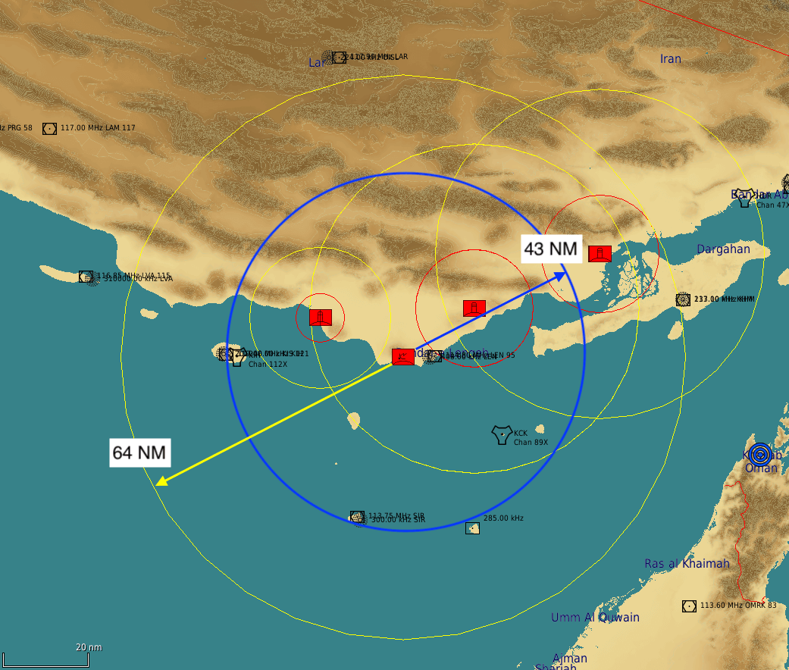
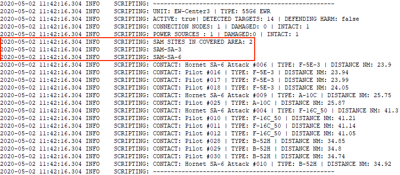

# FAQ

## Does Skynet IADS have an impact on game performance?

Skynet may actually improve game performance when using a lot of SAM AI units. This is because
Skynet will turn off radar emissions of all SAM groups currently not in range of a target. By
default these SAM groups would otherwise have their radars on. Skynet caches target information for
a few seconds to reduce expensive calls on DCS radar detection.

## What air defence units shall I add to the Skynet IADS?

In theory you can add all the types that are listed in the
[skynet-iads-supported-types.lua](https://github.com/VEAF/Skynet-IADS/blob/master/skynet-iads-source/skynet-iads-supported-types.lua)
file.
Very short range units (like the Shilka AAA, Rapier) won't really benefit from the IADS apart from
reacting to HARMs. These are better just placed in a mission and handled by the default AI of DCS.
This is due to the short range of their radars. By the time the IADS wakes them up, the contact has
likely passed their engagement range.
The strength of the Skynet IADS lies with handling long range systems that operate by radar.

## Which SAM systems can engage HARMS?

As of July 2022 only the SA-15, SA-10, NASAMS and Patriot have been confirmed to engage HARMS. The
best option for a solid HARM defence is to add SA-15's around EW radars or high value SAM sites.

## What exactly does Skynet do with the SAMs?

Via the scripting engine one can toggle the radar emitters on and off. Further options are the
alarm state and the rules of engagement. In a nutshell that's all that Skynet does. Skynet does
also read the radar and firing range properties of a SAM site. Based on that data and the setup
options a mission designer provides, Skynet will turn a SAM site on or off.

No god-like intervention is used (like magically exploding HARMS via the scripting engine).
If a SAM site or EW radar detects an inbound HARM it just turns off its radar as in real life. The
HARM as it is programmed in DCS will try and glide in to the last known position, mostly resulting
in misses by 50-100 meters.

## Are there known bugs?

Yes, when placing multi-unit SAM sites (e.g. SA-3, Patriot..) make sure the first unit you place is
the search radar. If you add any other element as the first unit, Skynet will not be able to read
radar data.
The result will be that the SAM site won't go live. This bug was observed in DCS 2.5.5. The SAM
site will work fine when used as a standalone unit outside of Skynet.

## How do I know if a SAM site is in range of an EW site or a SAM site in EW mode?

To get a rough idea you can look at the range circles in the mission editor. However these ranges
are greater than the actual in-game detection ranges of an EW radar or SAM site.
The following screenshot shows the range of the 1L13 EWR. The mission editor shows a range of 64 NM
(nautical miles) whereas the in-game range is 43 NM.

In this example the SAM site to the north east would not be in range of the EW radar, therefore it
would go into autonomous mode once the mission starts.

Set the debug options `samSiteStatusEnvOutput` and `earlyWarningRadarStatusEnvOutput` (see [setting
debug information](api.md#setting-debug-information)) to get detailed information on every SAM
site and EW radar.
The text marked in the red box will show you which SAM sites are in the covered area of a SAM site
or EW radar.

## How do I connect Skynet with the MOOSE AI_A2A_DISPATCHER and what are the benefits of that?

See [connecting Skynet to the MOOSE AI_A2A_DISPATCHER](api.md#connecting-skynet-to-the-moose-ai_a2a_dispatcher).
