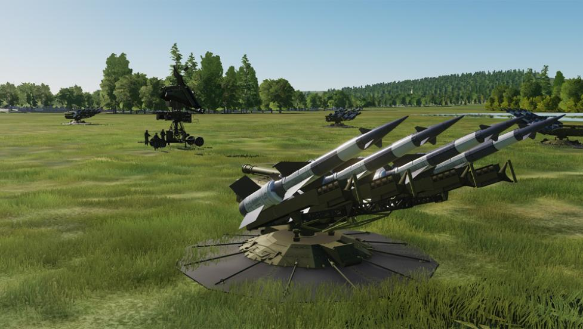

# Skynet-IADS



An IADS (Integrated Air Defence System) script for DCS (Digital Combat Simulator).

## Abstract

This script simulates an IADS within the scripting possibilities of DCS. Early Warning Radar
Stations (EW Radar) scan the sky for contacts. These contacts are correlated with SAM (Surface to
Air Missile) sites. If a contact is within firing range of the SAM site it will become active.

A modern IADS also depends on command centers and datalinks to the SAM sites. The IADS can be set
up with this infrastructure. Destroying it will degrade the capability of the IADS.

This all sounds gibberish to you? Watch [this video by Covert Cabal on modern
IADS](https://www.youtube.com/watch?v=9J9kntzkSQY).

Visit [this DCS forum
thread](https://forums.eagle.ru/topic/226173-skynet-an-iads-for-mission-builders) for development
updates.

Join the [Skynet discord group](https://discord.gg/pz8wcQs) and get support setting up your
mission.

Skynet supports the [HighDigitSAMs Mod](https://github.com/Auranis/HighDigitSAMs).

You can also connect [Skynet with the AI_A2A_DISPATCHER](api.en.md#connecting-skynet-to-the-moose-ai_a2a_dispatcher)
by MOOSE to add interceptors to the IADS.

**So far over 200 hours of work went in to the development of Skynet.
If you like using it, please consider a donation:**

[](https://www.paypal.com/cgi-bin/webscr?cmd=_s-xclick&hosted_button_id=7GSVFH448BWFQ&source=url)

## Quick start {#quick-start}

Tired of reading already? Grab `skynet-test-persian-gulf.miz` from the [latest
release](https://github.com/VEAF/Skynet-IADS/releases) and see Skynet in action on the Persian Gulf
map. It is attached to the release beside `skynet-iads-compiled.lua`, and it carries exactly the
Skynet that release ships.

The `.miz` files in the repository itself are **templates**: they hold a placeholder where each
script goes, so that a copy of the code committed beside the code cannot quietly fall three years
behind — which is what happened, until 2026-09-20. If you are working from a clone, assemble the
playable missions yourself, into `build/missions/`:

```
pwsh -File build-tools/build-compiled-script.ps1
python build-tools/miz-suite.py build
```

## Thanks

Special thanks to Spearzone and Coranthia for researching public available information on IADS
networks and getting me up to speed on how such a system works.
I based the SAM site setup on [Grimes SAM DB](https://forums.eagle.ru/showthread.php?t=118175) from
his IADS script, however I removed range data since Skynet loads that from DCS.
