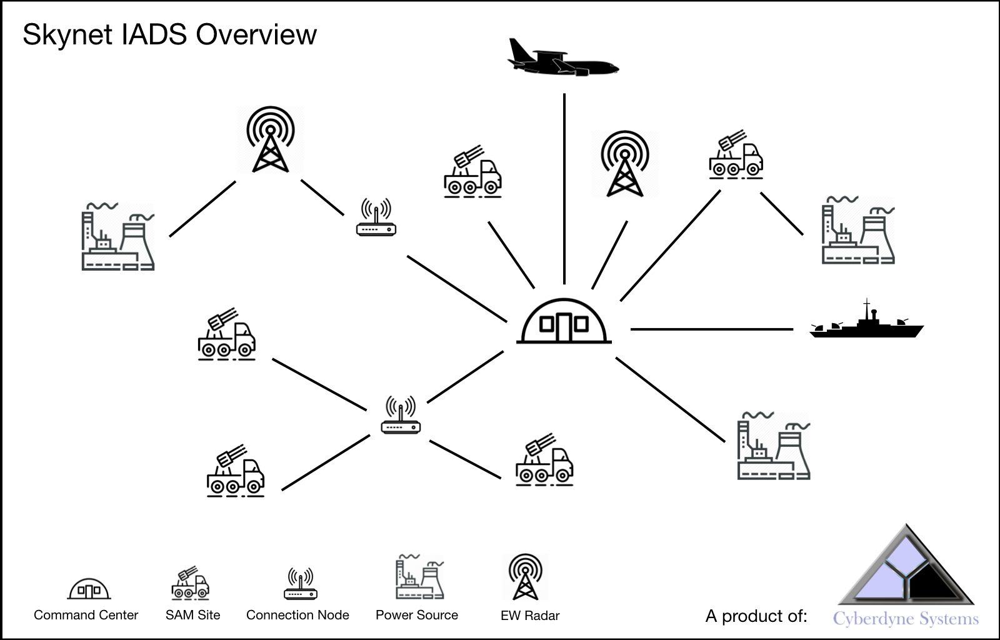
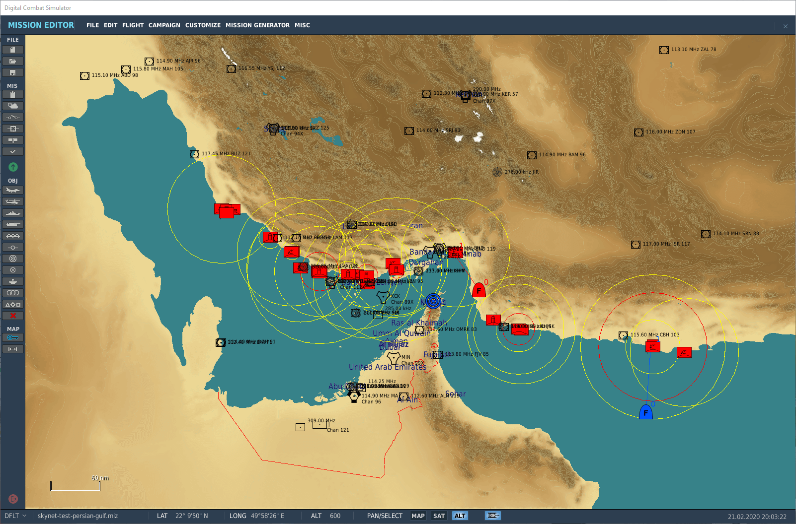
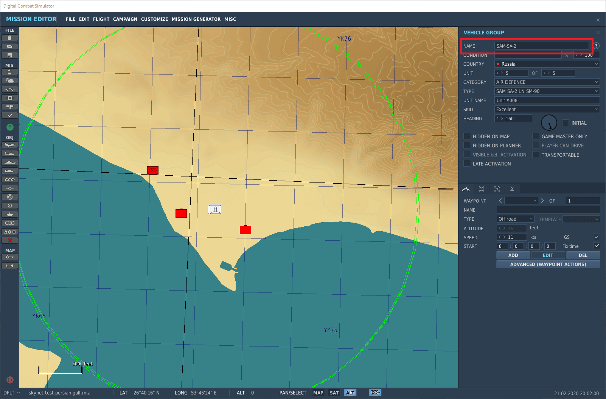
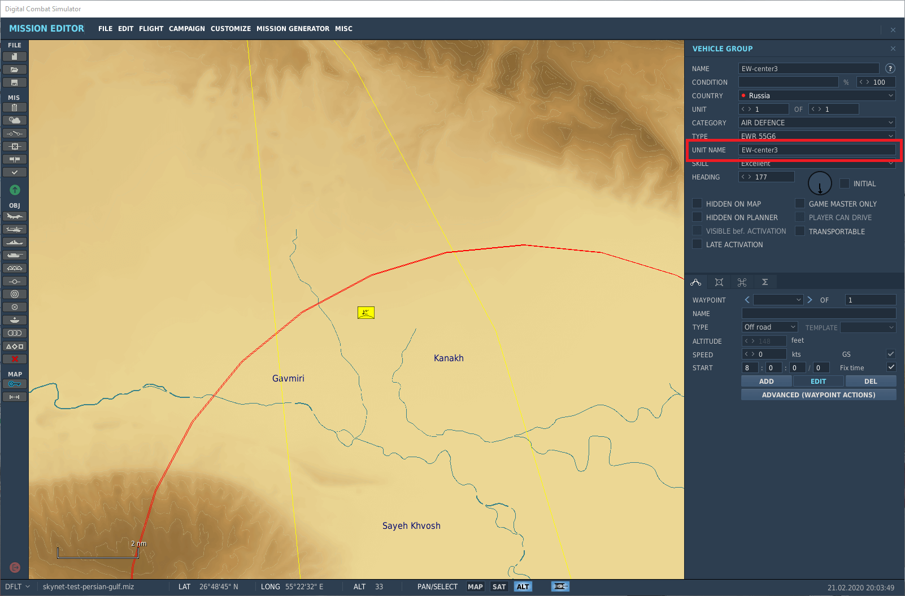
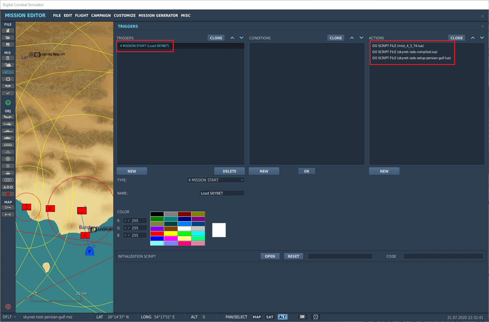

# Mettre en place un IADS

## Les éléments d'un Skynet IADS



### L'IADS

Un Skynet IADS est un réseau opérationnel complet. Vous pouvez avoir plusieurs instances de Skynet
IADS par coalition dans une mission DCS. Un montage simple consiste en un IADS pour le camp bleu et
un IADS pour le camp rouge.

### Les pistes (track files)

Skynet tient un fichier de pistes global rassemblant toutes les cibles détectées. Il interroge
toutes ses unités dotées d'un radar et dédoublonne les contacts. Par défaut, un contact perdu est
conservé en mémoire jusqu'à 32 secondes.

### Les centres de commandement

Vous pouvez ajouter plusieurs centres de commandement à un Skynet IADS. Une fois tous les centres
de commandement détruits, l'IADS bascule en mode autonome.

### Les sites SAM

Skynet sait gérer plusieurs sites SAM ; il cherche à réduire les émissions au minimum, et par
défaut un site SAM ne s'allume donc que si une cible est à portée.
La distance est analysée individuellement pour chaque lanceur et chaque radar du site.
Dès qu'au moins un lanceur et un radar sont à portée, le site SAM s'active.
Cela autorise une implantation dispersée des radars et des lanceurs, comme dans la réalité.

Un site SAM ou une DCA guidée par radar qui n'a plus de munitions s'éteint. Dans le cas d'un site
SAM, l'extinction attend que le dernier missile tiré ne soit plus en vol.

Si un EW radar, ou un site SAM jouant le rôle d'EW radar, est détruit, les sites SAM alentour
peuvent se retrouver sans couverture radar de veille lointaine. Cela arrive aussi lorsqu'un site
SAM sort de la couverture d'un AWACS.
Le site SAM passe alors en mode autonome : il utilise ses radars organiques, ou reste éteint, selon
la configuration.
Dès qu'il retrouve la couverture d'un EW radar, l'IADS recommence à l'alimenter.

### Les radars de veille lointaine (EW radars)

Skynet sait gérer de 0 à n EW radars. La détection des cibles s'appuie sur la logique de détection
radar de DCS.
Vous pouvez employer dans un rôle de veille lointaine n'importe quel type de radar listé dans
[skynet-iads-supported-types.lua](https://github.com/VEAF/Skynet-IADS/blob/master/skynet-iads-source/skynet-iads-supported-types.lua).
Certains radars SAM modernes portent plus loin que d'anciens EW radars : par exemple le 64H6E du
S-300PS (160 km) face au 55G6 EWR (120 km).

Vous pouvez aussi désigner des sites SAM pour tenir le rôle d'EW radar ; dans ce cas, le site garde
son radar allumé en permanence. Les systèmes à longue portée comme le S-300 servent de radars de
veille dans la réalité.
Un site SAM à court de munitions reste allumé s'il est configuré pour tenir ce rôle.

Bon à savoir : le relief autour d'un EW radar crée des angles morts, qui permettent à un avion bas
et rapide de percer un réseau radar en suivant les vallées.

### Les sources d'énergie

Par défaut, un Skynet IADS fonctionne sans qu'il soit nécessaire d'ajouter des sources d'énergie.
Vous pouvez en ajouter plusieurs aux sites SAM, aux EW radars et aux centres de commandement.
Dès qu'une source d'énergie est complètement détruite, l'unité Skynet IADS qu'elle alimente cesse
de fonctionner.

Bon à savoir : neutraliser la source d'énergie d'un centre de commandement est une tactique bien
réelle de SEAD (Suppression of Enemy Air Defence).

### Les nœuds de liaison (connection nodes)

Par défaut, un Skynet IADS fonctionne sans qu'il soit nécessaire d'ajouter des nœuds de liaison.
Vous pouvez en ajouter plusieurs aux sites SAM, aux EW radars et aux centres de commandement.

Lorsque tous les nœuds de liaison d'une unité sont détruits, l'EW radar ou le site SAM passe en
mode autonome. Pour un site SAM, cela veut dire qu'il applique le comportement autonome configuré.
Un EW radar qui perd son nœud cesse d'alimenter l'IADS en informations, mais l'IADS continue de
fonctionner par ailleurs. Les centres de commandement, eux, n'ont pas de mode autonome.

Bon à savoir : un même nœud peut relier un nombre quelconque d'unités Skynet IADS. C'est ainsi que
vous introduisez un point de défaillance unique dans un IADS.

### AWACS (Airborne Early Warning and Control System)

N'importe quel aéronef doté d'un radar air-air peut être ajouté comme AWACS. Les contacts qu'il
détecte sont versés à l'IADS. L'AWACS détecte également les unités au sol, navires compris. Ces
contacts-là, en revanche, ne sont pas transmis aux sites SAM.

Vous pouvez donner un nœud de liaison à l'AWACS — une antenne, par exemple : s'il est détruit,
l'AWACS ne peut plus alimenter l'IADS en contacts.
Techniquement, vous pouvez aussi lui donner une source d'énergie. Dans ce contexte, elle représente
l'alimentation du nœud de liaison, puisqu'un aéronef produit la sienne.

### Les navires

Un navire alimente l'IADS exactement comme une unité AWACS. Ajoutez-le comme un EW radar ordinaire.

## Utiliser Skynet dans l'éditeur de mission

Monter un IADS est assez simple : jetez un œil aux scripts de configuration dans
[demo-missions/](https://github.com/VEAF/Skynet-IADS/tree/master/demo-missions) — et aux missions de
démonstration elles-mêmes, qui sont [jointes à une
release](https://github.com/VEAF/Skynet-IADS/releases) plutôt que déposées dans le dépôt. Le
[démarrage rapide](index.md#quick-start) explique pourquoi, et comment en assembler une depuis un
clone.

### Placer les unités

Ce tutoriel suppose que vous savez monter un site SAM dans DCS. Si ce n'est pas le cas, je vous
conseille [cette vidéo](https://www.youtube.com/watch?v=YZPh-JNf6Ww) des Grim Reapers.
Placez sur la carte les éléments de l'IADS que vous voulez ajouter.



### Préparer un site SAM

Il ne doit y avoir **qu'un seul type de site SAM par groupe**. Au-delà, Skynet ne saura pas piloter
le groupe correctement. Évitez également d'ajouter au groupe SAM des unités dont le système n'a pas
besoin : camions, chars, fantassins.
Le niveau de compétence (skill) que vous donnez à un groupe SAM est conservé par Skynet. Veillez à
nommer le **groupe du site SAM** de façon cohérente, avec un préfixe, par exemple `SAM-SA-2`.



### Préparer un EW radar

N'importe quel type de radar peut servir d'EW radar. Veillez à **nommer l'unité** de façon
cohérente, avec un préfixe, par exemple `EW-center3`. Veillez également à n'avoir qu'**un seul EW
radar par groupe**, sans quoi Skynet ne pourra pas piloter les radars un par un.



### Ajouter le code de Skynet

Chargez le code compilé de Skynet dans une mission. Skynet n'a pas besoin de MIST : le fichier
[skynet-iads-compiled.lua](https://github.com/VEAF/Skynet-IADS/releases) joint à chaque release est
un script autonome, et les missions de démonstration ne l'embarquent plus non plus. Si votre propre
mission utilise MIST pour autre chose, les deux cohabitent sans problème ; la version courante est
[ici](https://github.com/mrSkortch/MissionScriptingTools).

Je vous conseille de créer un fichier texte, `my-iads-setup.lua` par exemple, et d'y écrire le code
nécessaire au démarrage de l'IADS. Lorsque vous modifiez votre configuration, pensez à recharger le
fichier dans l'éditeur de mission, sans quoi les changements resteront sans effet.
Vous pouvez aussi saisir le code directement dans l'éditeur de mission, mais le champ est plutôt
étroit dès que vous écrivez plus de quelques lignes.



### Ajouter le Skynet IADS

Quatre lignes de code suffisent à faire fonctionner l'IADS.

Créez une instance de l'IADS ; la chaîne de caractères qui le nomme est facultative et sera
affichée dans les sorties d'état :

```lua
redIADS = SkynetIADS:create('name')
```

Donnez un préfixe commun, dans l'éditeur de mission, à tous les groupes SAM que vous voulez ajouter
— par exemple `SAM-SA-10 west` — puis ajoutez cette ligne :

```lua
redIADS:addSAMSitesByPrefix('SAM')
```

Même chose pour les EW radars : nommez toutes les unités avec un préfixe commun, par exemple
`EW-radar-south` :

```lua
redIADS:addEarlyWarningRadarsByPrefix('EW')
```

Activez l'IADS :

```lua
redIADS:activate()
```

Consultez la [référence de l'API](api.md) pour tout le reste : centres de commandement, sources
d'énergie, nœuds de liaison, conditions d'activation, brouilleur, et l'exemple de montage complet.
