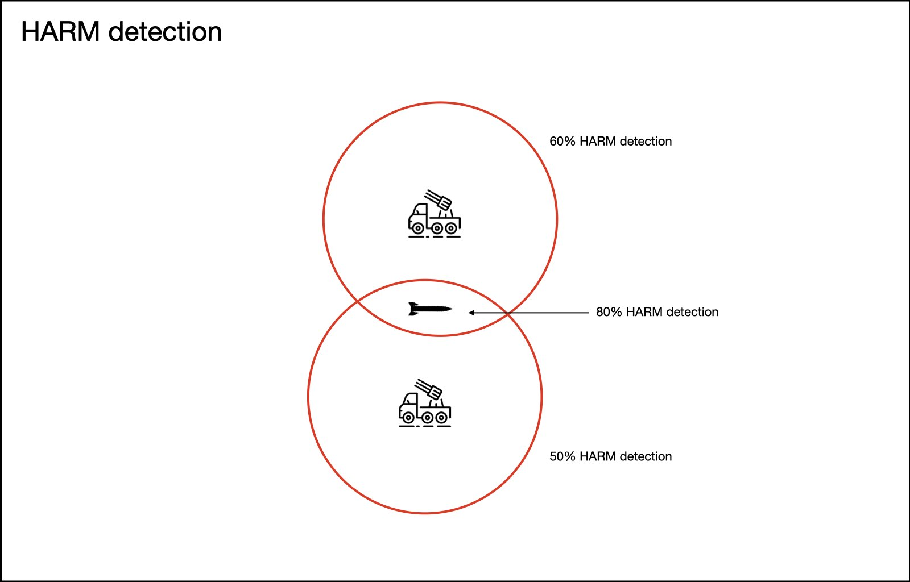
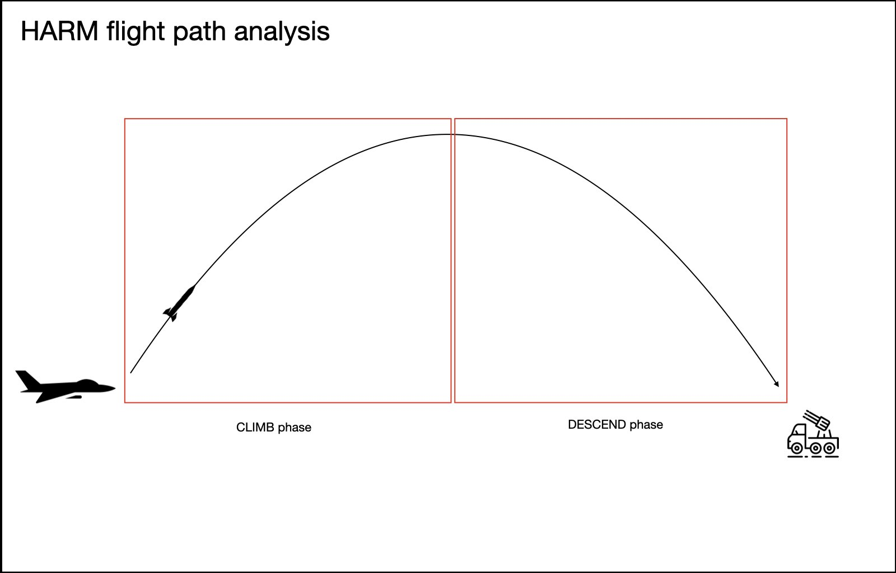
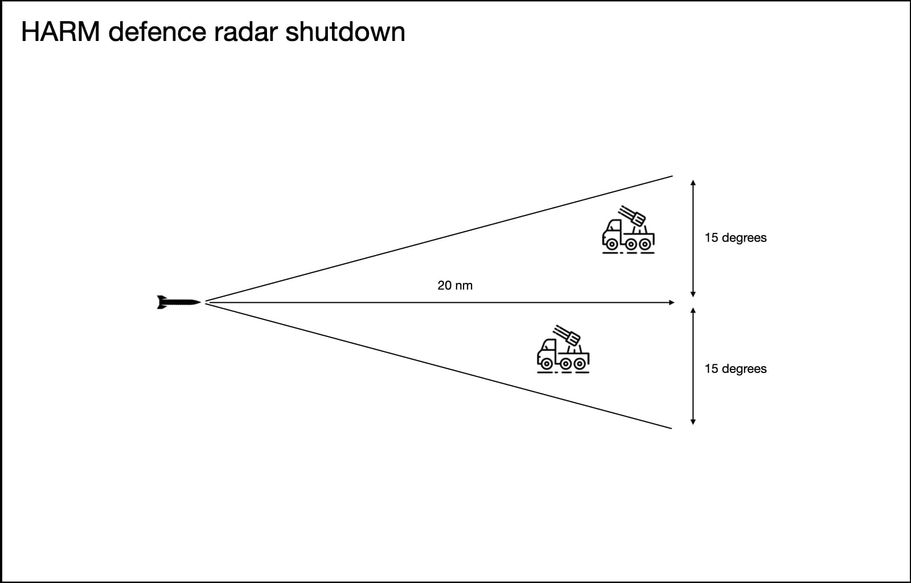

# Tactics

## HARM defence

SAM sites and EW radars will shut down their radars if they believe a HARM (High speed anti
radiation missile) is heading for them. For this to happen, the IADS will evaluate contacts and
determine if they are likely to be HARMs.
Each SAM site or EW radar has a HARM detection chance set. If a HARM is detected by more than one
radar, the chance of it being identified as a HARM is increased.
See
[skynet-iads-supported-types.lua](https://github.com/VEAF/Skynet-IADS/blob/master/skynet-iads-source/skynet-iads-supported-types.lua)
field `harm_detection_chance` for the probability per radar system.

### HARM detection

Let's say SAM site A has a 60% HARM detection chance and SAM site B has a 50% HARM detection
chance. If a HARM is picked up by both radars the chance the IADS will identify the HARM will be
80%.

With the radar cross section updates of HARMs in DCS 2.7 older radars like the ones used in the
SA-2 and SA-6 can only identify a HARM at very close range, usually less than 10 seconds before
impact. These systems will not have a very good HARM defence with Skynet.

### HARM flight path analysis

The contact needs to be traveling faster than 800 kt and it may not have changed its flight path
more than 2 times (e.g. `climb-descend`, `climb` or `descend`). This is to minimise false
positives, for example a fighter flying very fast.

This implementation is closer to real life. SAM sites like the Patriot and most likely modern
Russian systems calculate the flight path and analyse the radar cross section to determine if a
contact heading inbound is a HARM.

If identified as a HARM the IADS will shut down radars 15 degrees left and right of the HARM's
flight path up to a distance of 20 nautical miles in front of the HARM.
The IADS will calculate time to impact and shut down radar emitters up to a maximum of 180 seconds
after time to impact.

## HARM radar shutdown

Once a HARM has been identified by Skynet, radars up to 20 nm ahead and 15 degrees left or right of
the HARM will be notified. Depending on their settings radar emitters will shut down or start
defending against the HARM.

## Point defence {#point-defence}

When a radar emitter (EW radar or SAM site) is attacked by a HARM there is a chance it may detect
the HARM and go dark. If this radar emitter is acting as the sole EW radar in the area, surrounding
SAM sites will not be able to go live since they rely on the EW radar for target information. This
is an issue if you have SA-15 Tors next to the EW radar for point defence protection: they will
stay dark and not engage the HARM.

Use this feature if you don't want the IADS to lose situational awareness just because a HARM is
inbound. The radar emitter will shut down if it believes its point defences won't be able to handle
the number of HARMs inbound. As long as there is one point defence launcher and missile per HARM
inbound the radar emitter will keep emitting. If the HARMs exceed the number of point defence
launchers and missiles the protected asset will shut down. Tests in DCS have shown that this is
roughly the saturation point. If the SAM site relying on point defence can engage HARMs its
launchers and missiles will also count to the saturation point.

See [which SAM systems can engage HARMs?](faq.md#which-sam-systems-can-engage-harms) and the
[point defence setup example](api.md#point-defence).

## Electronic warfare

A simple form of jamming is part of the Skynet IADS package. It's off by default. The jamming works
by setting the ROE state of a SAM Site.
The closer the jamming emitter gets to a SAM site the less effective jamming will become (burn
through). For the jammer to work it will need LOS (line of sight) to a radar unit.
Older SAM sites are more susceptible to jamming. EW radars are currently not jammable.

I recommend you add an AI unit that follows the strike package you're flying in to act as a jammer
aircraft. This will give you the most realistic experience.
The jammer emitter will toggle the ROE state of a SAM site which affects how the SAM site reacts to
all threats near or far.

I presume an aircraft very close to a SAM site being jammed by an emitter very far away would most
likely be detected.
So the farther away you are from the jammer source the more unrealistic your experience will be.

Here is a [list of SAM sites currently supported by the
jammer](https://docs.google.com/spreadsheets/d/16rnaU49ZpOczPEsdGJ6nfD0SLPxYLEYKmmo4i2Vfoe0/edit#gid=0)
and the jammer's effectiveness on them.
When setting up a jammer you can decide which SAM sites it is able to jam. For example you could
design a mission in which the jammer is not able to jam a SA-6 but is able to jam a SA-2.
The jammer effectiveness is not based on any real world data, it's based on reading about the
different types and drawing conclusions from that.

Here is an old school documentary [showing the Prowler in
action](https://www.youtube.com/watch?v=su44ZU7NcQU). They brief to turn on their jamming equipment
at 60 nm from the target. That must have been the effective range of 70's jamming tech.

See [adding a jammer](api.md#adding-a-jammer) for the setup.
